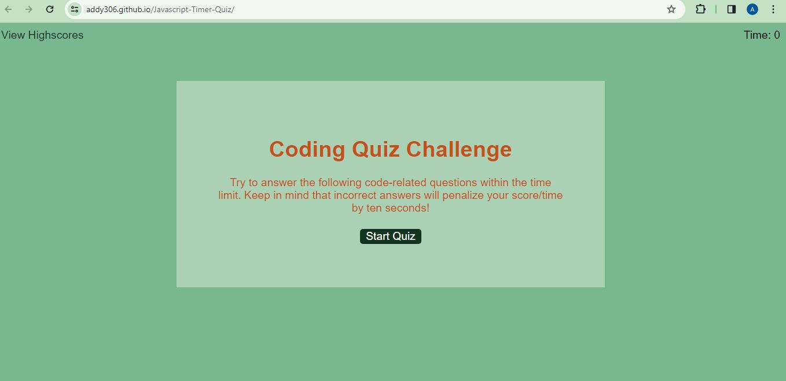
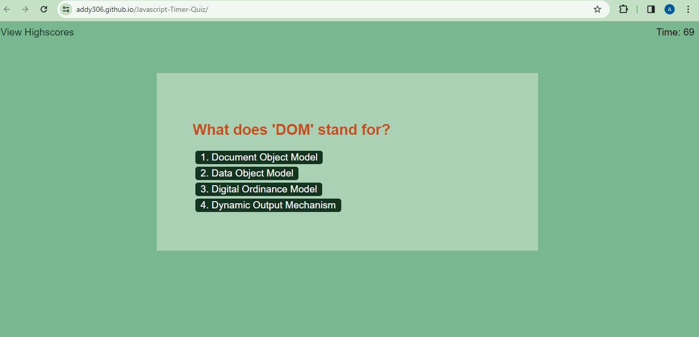
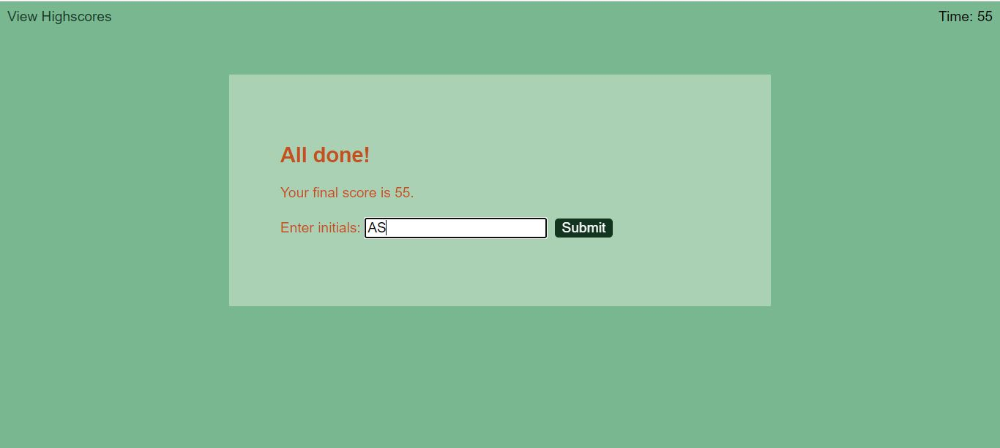

# Javascript-Timer-Quiz

<!-- Developer Signature and github details -->
 

  

<h3 align="center"> Javascript-Timer-Quiz</h3>

  

    An application of a timed quiz on JavaScript fundamentals that stores high scores so user can gauge progress compared to peers.  
     
    <a href="https://github.com/addy306/Javascript-Timer-Quiz"><strong>GitHub repository</strong></a>
     
    <a href="https://addy306.github.io/Javascript-Timer-Quiz/"><strong>Deployed Website</strong></a>
     
     
    
  

<!-- ABOUT THE PROJECT -->
## About The Project

An application of a timed quiz on JavaScript fundamentals that stores high scores so user can gauge progress compared to peers. 

### Built With

* HTML
* CSS
* Javascript

### App pages

### Start Screen

### Question Screen

### Score Screen

### Highscore Screen

<!-- LICENSE -->
## License

Distributed under the MIT License. See `LICENSE.txt` for more information.

Project Link: [https://github.com/addy306/Javascript-Timer-Quiz](https://github.com/addy306/Password-Generator)

Deployed Website: [https://addy306.github.io/Javascript-Timer-Quiz/](https://addy306.github.io/Javascript-Timer-Quiz/)

## Helpful Resources
- [Google](https://www.google.com/)
- [Stackoverflow](https://stackoverflow.com/)

- [W3Schools](https://www.w3schools.com/js/DEFAULT.asp)

- [Github Pages Guide](https://pages.github.com/)

